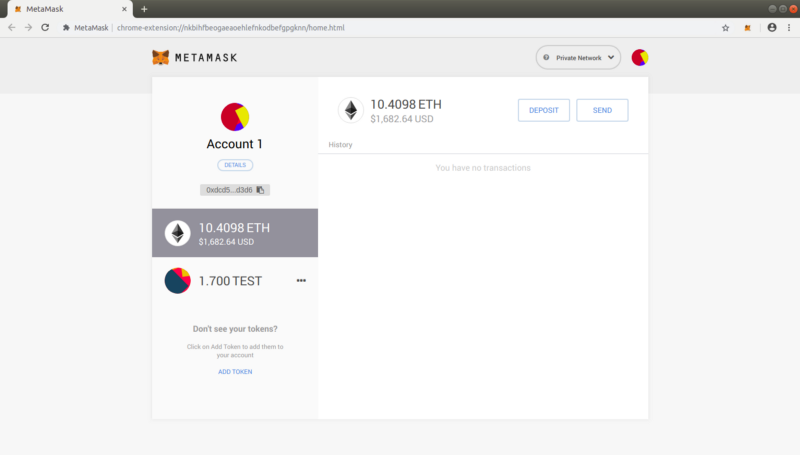
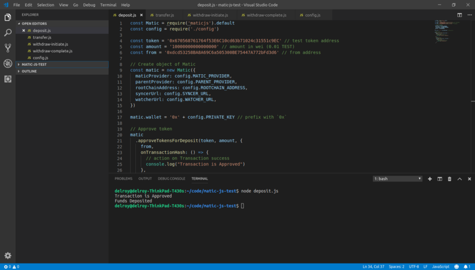
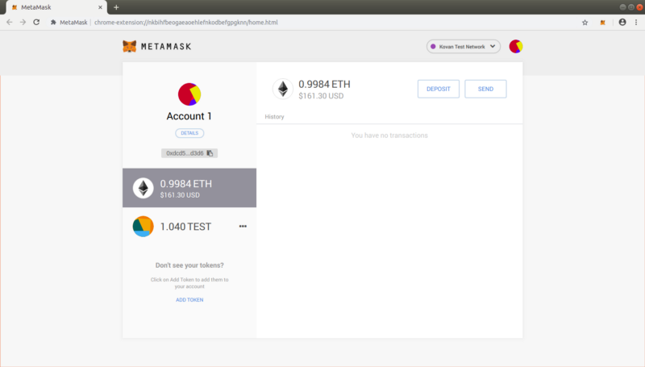
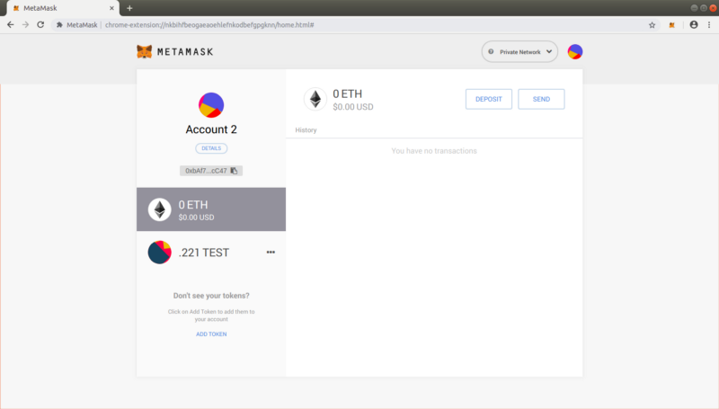
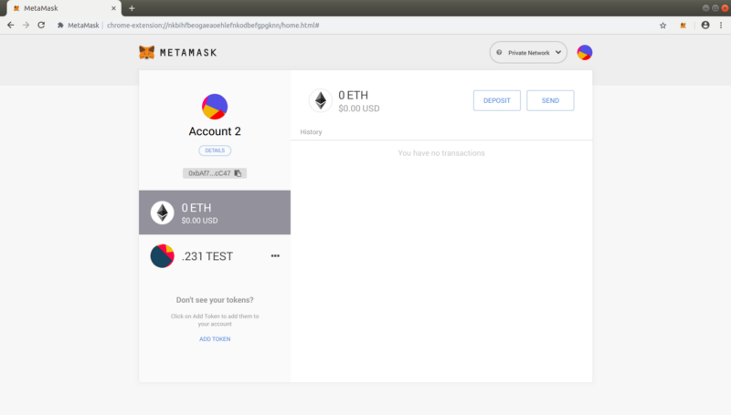
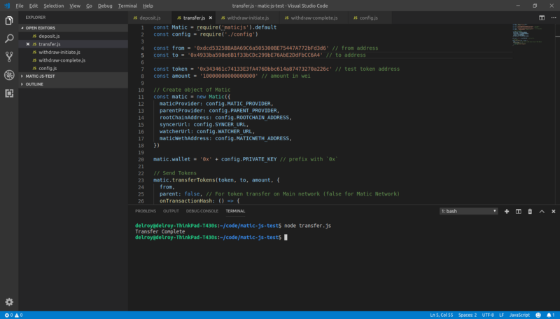
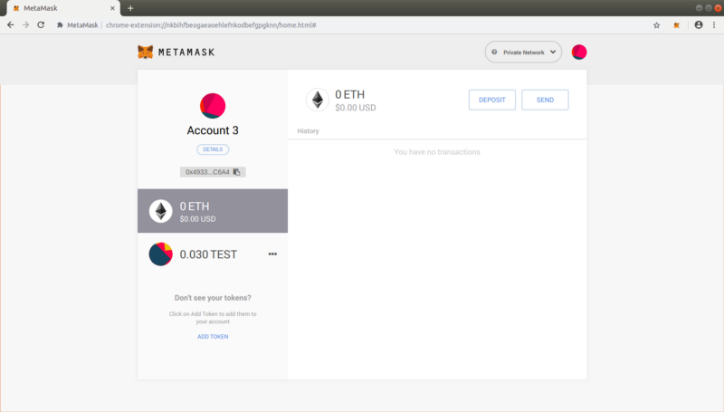
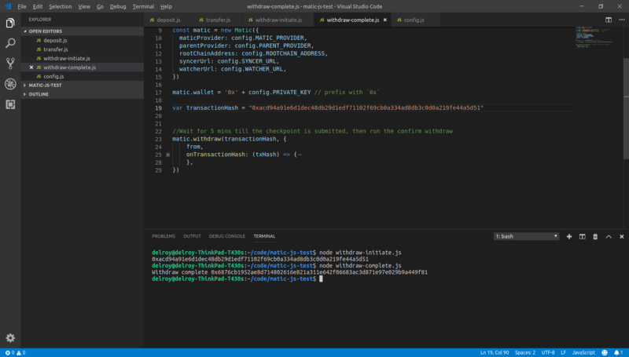
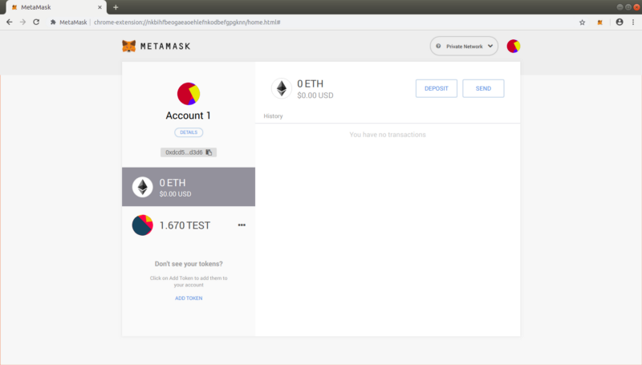

# Beginner-friendly tutorial to Matic.js

This tutorial will act as a guide for a step-by-step process to understand and use [Matic JS](http://github.com/maticnetwork/matic.js), which is the easiest way to interact with the Matic Network. This guide is directed towards developers just starting to begin their Ethereum journey. Experienced developers can skim through the article or choose to directly go to https://docs.matic.network/getting-started/

### Prerequisites:

### Some ETH on Kovan in your account

In order to make any transactions, you will also need some Ether in the test accounts that you will use while following the tutorial. In case you don’t have some ETH on Kovan, you can use the faucet links given here — https://faucet.metamask.io/ or https://gitter.im/kovan-testnet/faucet. 

### Matic Faucet

Throughout this tutorial, we will be using the ERC20 token `TEST` on the Kovan network as an example. In your DApp, you can replace it with any ERC20 token. To get some example `TEST` tokens on Matic Network, you can drop an email to info@matic.network

This is only a temporary workaround till we get our Matic Faucet up and running.

## Using Matic JS

We will be showcasing the flow for asset transfers on the Matic Network in this tutorial and how you can do the same using Matic.js:


* User deposits tokens in Matic contract on mainchain
* Once deposited tokens get confirmed on the main chain, the corresponding tokens will get reflected on the Matic chain.
* The user can now transfer tokens to anyone they want instantly with negligible fees. Matic chain has faster blocks (approximately 1 second). That way, the transfer will be done almost instantly.
* Once a user is ready, they can withdraw remaining tokens from the mainchain by establishing proof of remaining tokens on Root contract (contract deployed on Kovan/Ethereum chain) within 7 days.
* User can also get a fast exit via 0x or Dharma (coming soon!)


### Basic setup for the tutorial

To easily visualise the flow of funds on the Matic Network, it is instructive if you configure the Matic testnet on Metamask. Note that we are using Metamask here solely for visualization purposes. There is no requirement to use Metamask at all for using the Matic Network.

Before starting with the tutorial, go ahead and have 3 Ethereum test accounts ready. In case you are new to Ethereum and Metamask, you can refer https://docs.matic.network/newbies/create-accounts-metamask/ on instructions on how to.

For your reference we will be using the following accounts in this tutorial

```js
Account #1: 0xdcd53258BA8A69C6a505300BE75447A772bFd3d6
Account #2: 0xbAf7D06543b241E286dc776545c8e9F318aBcC47
Account #3: 0x4933ba598e6B1f33bCDc299bE76AbE2DdFbCC6A4
```

When you create multiple accounts at your end, your addresses will be different from those shown here.

In order to view the flow of funds easily on the Matic Network using Matic.js, you can configure Matic’s testnet URL on Metamask. Refer this link — https://docs.matic.network/newbies/conf-testnet-metamask/ to quickly set it up. Note this is **optional**. You can query using web3, if you choose to.

### Configuring `TEST` tokens on Metamask

The `TEST` token, taken as an example for this tutorial, can be configured in Metamask so as to easily visualise account balances. Again note this is **optional**. You can very easily query the token balances and other variables using [web3](https://web3js.readthedocs.io/en/1.0/)

The TEST token needs to be added to all 3 test accounts in Metamask once each in both the Kovan and Matic testnets: 

```js
Token name: TEST 
Where: Kovan Network
Contract address: 0x670568761764f53E6C10cd63b71024c31551c9EC

----------------------

Token name: TEST 
Where: Matic Testnet (Custom RPC: https://testnet.matic.network)
Contract address: 0x343461c74133E3fA476Dbbc614a87473270a226c
```

In case you are new to Ethereum and Metamask, you can refer https://docs.matic.network/newbies/conf-custom-tokens-metamask/ on instructions on how to.

## Introducing Matic.js

The Matic.js repository is hosted on Github at https://github.com/maticnetwork/matic.js/

For reference purposes, I will be creating a test folder to showcase how to setup Matic.js step-by-step. Go ahead and create a folder for this tutorial — I am going with `$ mkdir matic-js-test`

Install the `maticjs` package via npm:

`$ npm install --save maticjs`

If you wish to directly refer a set of code examples, you can do so at https://github.com/maticnetwork/matic.js/tree/master/examples

### Depositing Funds from Kovan to Matic

Within the `matic-js-test` folder, create a new file and name it `deposit.js`.

```js
const Matic = require('maticjs').default
const config = require('./config')
const token = '0x670568761764f53E6C10cd63b71024c31551c9EC' // test token address
const amount = '10000000000000000' // amount in wei (0.01 TEST)
const from = '0xdcd53258BA8A69C6a505300BE75447A772bFd3d6' // from address

// Create object of Matic
const matic = new Matic({
  maticProvider: config.MATIC_PROVIDER,
  parentProvider: config.PARENT_PROVIDER,
  rootChainAddress: config.ROOTCHAIN_ADDRESS,
  syncerUrl: config.SYNCER_URL,
  watcherUrl: config.WATCHER_URL,
})

matic.wallet = '0x' + config.PRIVATE_KEY // prefix with `0x`

// Approve token from your account to the Matic contracts
matic
  .approveTokensForDeposit(token, amount, {
    from,
    onTransactionHash: () => {
      // action on Transaction success
      console.log("Deposit Tokens from Kovan/Ethereum to Matic - Transaction Approved.")
    },
})
.then(() => {
// Deposit tokens
matic.
  depositTokens(token, from, amount, {
    from,
    onTransactionHash: () => {
      // action on Transaction success
      console.log("Tokens deposited from Kovan/Ethereum to Matic.")
    },
  })
})
```

Let’s understand this a bit in detail. 

`token` is the address of the `TEST` ERC20 token contract taken as an example in this tutorial. You will replace it with the relevant ERC20 token address in your DApp.

```js
const token = '0x670568761764f53E6C10cd63b71024c31551c9EC' // test token address
```

`amount` is the amount that is to be deposited. Amount is mentioned in `wei` . To those new to the field, `1 TEST` token is equivalent to 10¹⁸ `wei` . In the code snippet, `0.01 TEST` = 10¹⁶ `wei`.

```js
const amount = '10000000000000000' // amount in wei (0.01 TEST)
```

`from` is your address. This will be address from which funds will be debited. Note that this is my test account address — you will need to plug your own in here.

```js
const from = '0xdcd53258BA8A69C6a505300BE75447A772bFd3d6' // from address
```

`matic.wallet` is your private key. **Never store your private key in code on production** — this is shown here only for illustration purposes. Typically a user’s private key will be stored in a browser wallet such as Metamask or a mobile wallet such as the Matic wallet, Status or a hardware wallet.

```js
matic.wallet = '0x' + config.PRIVATE_KEY // prefix with `0x`
```

You will also need to create another file `config.js`. This will contain all configuration related to Matic.js.

```js
module.exports = {
  MATIC_PROVIDER: 'https://testnet.matic.network',
  PARENT_PROVIDER: 'https://kovan.infura.io/matic',
  ROOTCHAIN_ADDRESS: '0x24e01716a6ac34d5f2c4c082f553d86a557543a7',
  SYNCER_URL: 'https://eth-syncer.api.matic.network/api/v1',
  WATCHER_URL: 'https://eth-watcher.api.matic.network/api/v1',
  MATICWETH_ADDRESS: '0xeD3CAFb4dCf835E7a1D2E3169F8D296f931b4aA7',
  PRIVATE_KEY: '<insert-your-private-key-here>'
}
```

For now, don’t worry about these values — just keep them as is.

You will need to add your private key here. Signing of transactions will require your private key. Again, it is **NOT ADVISABLE** to hard code your private key when on production. Later, you can build keeping in mind that the user will be handling their keys at their end with MetaMask, Matic Wallet or any other compatible user wallet.

```js
PRIVATE_KEY: '<insert-your-private-key-here>'
```

Deposit is a 2 step process

* The tokens need to be first approved to the Matic rootchain contract on Ethereum.

```js
// Approve token from your account to the Matic contracts
matic
  .approveTokensForDeposit(token, amount, {
    from,
    onTransactionHash: () => {
      // action on Transaction success
      console.log("Deposit Tokens from Kovan/Ethereum to Matic - Transaction Approved.")
    },
})
```

* Once approved, the deposit function is to be invoked where the tokens get deposited to the Matic contract, and are available for use in the Matic network.

```js
// Deposit tokens
matic.
  depositTokens(token, from, amount, {
    from,
    onTransactionHash: () => {
      // action on Transaction success
      console.log("Tokens deposited from Kovan/Ethereum to Matic.")
    },
})
```

For reference purposes, the screenshots below will provide context during the actual deposit.

We currently have `1.050 TEST` tokens and `0.9986` ETH at our address `(0xdcd53258BA8A69C6a505300BE75447A772bFd3d6)` on Kovan Network, 


while on Matic Network we have `10.40 Matic ETH` and `1.700 TEST` tokens.



We will be depositing `0.010 TEST` tokens to Matic Testnet.

Let’s run the Deposit function. To run use:

`$ node deposit.js`

We have added console logging for both events, which when run successfully will display `“Deposit Tokens from Kovan/Ethereum to Matic — Transaction Approved.”.` Once deposit is complete, you will see the message `”Tokens deposited from Kovan/Ethereum to Matic.”`



Let’s verify our account balances on Metamask.

Our Balance on Kovan now shows `1.040 TEST` which means our Deposit transaction of `0.010 TEST` was successful.



Verifying our balance on Matic Testnet also shows that our balance is increased by 0.010 TEST. 


Congratulations! You have successfully deposited funds from Kovan to Matic.

In order to ensure you have more funds, deposit `1 TEST` token to Matic by repeating the above process. Make sure you change the `amount` value in the above script.

### Transferring funds from Matic

Once you have funds on Matic, you can use those funds to send to others instantly.

Create a new file — `transfer.js` —  in your code directory. 

```js
const Matic = require('maticjs').default
const config = require('./config')

const from = '0xdcd53258BA8A69C6a505300BE75447A772bFd3d6' // from address
const to = '0x4933ba598e6B1f33bCDc299bE76AbE2DdFbCC6A4' // to address

const token = '0x343461c74133E3fA476Dbbc614a87473270a226c' // test token address
const amount = '10000000000000000' // amount in wei (0.01 TEST)

// Create object of Matic
const matic = new Matic({
 maticProvider: config.MATIC_PROVIDER,
 parentProvider: config.PARENT_PROVIDER,
 rootChainAddress: config.ROOTCHAIN_ADDRESS,
 syncerUrl: config.SYNCER_URL,
 watcherUrl: config.WATCHER_URL,
 maticWethAddress: config.MATICWETH_ADDRESS,
})

matic.wallet = '0x' + config.PRIVATE_KEY // prefix with `0x`

// Send Tokens
matic.transferTokens(token, to, amount, {
 from,
 parent: false, // For token transfer on Main network (false for Matic Network)
 onTransactionHash: () => {
   // action on Transaction success
   console.log("Transfer")
 },
})
```

`to` is the receiver’s address, to whom the funds are supposed to be sent.

```js
const to = '0x4933ba598e6B1f33bCDc299bE76AbE2DdFbCC6A4' // to address
```

`token` is the Matic TEST token contract address on the Matic testnet. **Note that this is different from the Kovan TEST token contract address.**

```js
const token = '0x343461c74133E3fA476Dbbc614a87473270a226c' // test token address
```

The config details are then mentioned appropriately. You need not make any changes to it.

The transfer functionality is invoked here.

```js
matic.transferTokens(token, to, amount, {
 from,
 parent: false, // For token transfer on Main network (false for Matic Network)
 onTransactionHash: () => {
   // action on Transaction success
   console.log("Transfer done!")
},
```

**Sidenote** — you can change the `parent` parameter to TRUE if you are using Matic.js to transfer funds on the main Ethereum network.

We have added console logging on both events, which when run successfully will display `“Transfer done!”` to assure that the transaction was completed successfully.

We will be making 2 different transfers worth `0.01 TEST` and `0.01 TEST` tokens respectively.

The screenshots below will provide context during the actual transfer.

**Transfer #1**

We will be transferring `0.01 TEST` from Account 1 to Account 2 on Matic Network.

Account 1–`0xdcd53258BA8A69C6a505300BE75447A772bFd3d6`. This account currently holds `1.710 TEST` tokens.

Account 2–`0xbAf7D06543b241E286dc776545c8e9F318aBcC47`. This account currently holds `0.221 TEST` tokens.



Now we will run the transfer function. Run this on the terminal:

`$ node transfer.js`


Once the code has run successfully, it will display a message of `"Transfer done!"`

Let’s verify our balances on Metamask.

Our balance on account address — `0xdcd53258BA8A69C6a505300BE75447A772bFd3d6` is now updated to `1.700 TEST` tokens.


And to confirm that on our receiver’s account, our balance is now updated to `0.231 TEST` tokens.



**Transfer #2**

In this transaction we will attempt to transfer `0.01 TEST` from Account 1 to Account 3. 

From — `0xdcd53258BA8A69C6a505300BE75447A772bFd3d6`


To — `0x4933ba598e6B1f33bCDc299bE76AbE2DdFbCC6A4`. Account 3 currently has `0.020 TEST` tokens.


We will again run `$ node transfer.js` from the terminal. Once we get the `‘Transfer done!’` message, we will check our balances.



Balance on Account 1 now shows a balance of `1.690 TEST`,


whereas the balance on Account 3 shows us `0.030 TEST`.




### Withdraw funds from Matic

Funds that are available on Matic chain can be withdrawn back to the Ethereum Network.

In Matic, withdrawing is a 2 step process where:

1. Withdrawal of funds is initiated from Matic Network. A checkpoint interval of 5 mins is set, where all the blocks on the Matic block layer are validated since the last checkpoint.
2. Once the checkpoint is submitted to the mainchain Ethereum contract, an NFT Exit (ERC721) token is created of equivalent value. Users need to wait for a 7 day challenge period, post-which, the withdrawn funds can be claimed back to your Ethereum acccount from the mainchain contract.

For now, just go with the fact that the challenge period for withdrawals is an important part of the Plasma framework to ensure security of your transactions. Later, once you get to know the system better, the reason for the 7-day withdrawal window will become clear to you.

Just for reference, there will be an active exit market, which will allow trading of exit tokens (ERC721), thereby leading to faster withdrawals — but that is an article for another day.

**To keep the withdrawal process easier for now on the Matic Testnet, we have not enforced the 7-day withdrawal process**. This means while going through this tutorial and developing apps on the testnet, for now, you will get the withdrawn funds immediately.

Create 2 new files and name them `initiate-withdraw.js` and `confirm-withdraw.js`.

```js
const Matic = require('maticjs').default
const config = require('./config')

const mtoken = '0x343461c74133E3fA476Dbbc614a87473270a226c' // test token address
const amount = '10000000000000000' // amount in wei (0.01 TEST)
const from = '0xdcd53258BA8A69C6a505300BE75447A772bFd3d6' // from address

// Create object of Matic
const matic = new Matic({
 maticProvider: config.MATIC_PROVIDER,
 parentProvider: config.PARENT_PROVIDER,
 rootChainAddress: config.ROOTCHAIN_ADDRESS,
 syncerUrl: config.SYNCER_URL,
 watcherUrl: config.WATCHER_URL,
})

matic.wallet = '0x' + config.PRIVATE_KEY // prefix with `0x`

var transactionHash = null

matic
 .startWithdraw(mtoken, amount, {
   from,
   onTransactionHash: txHash => {
     transactionHash = txHash
     console.log("Withdraw Initiated")
     console.log(transactionHash)
   },
})
```

```js
const Matic = require('maticjs').default
const config = require('./config')

const mtoken = '0x343461c74133E3fA476Dbbc614a87473270a226c' // test token address
const amount = '10000000000000000' // amount in wei (0.01 TEST)
const from = '0xdcd53258BA8A69C6a505300BE75447A772bFd3d6' // from address

// Create object of Matic
const matic = new Matic({
 maticProvider: config.MATIC_PROVIDER,
 parentProvider: config.PARENT_PROVIDER,
 rootChainAddress: config.ROOTCHAIN_ADDRESS,
 syncerUrl: config.SYNCER_URL,
 watcherUrl: config.WATCHER_URL,
})

matic.wallet = '0x' + config.PRIVATE_KEY // prefix with `0x`

var transactionHash = "0xacd94a91e6d1dec48db29d1edf71102f69cb0a334ad8db3c0d0a219fe44a5d51"


//Wait for 5 mins till the checkpoint is submitted, then run the confirm withdraw
matic.withdraw(transactionHash, {
   from,
   onTransactionHash: (txHash) => {
   // action on Transaction success
   console.log("Withdraw complete",txHash)
   },
})
```

*Note: A checkpoint, which is a representation of all transactions happening on the Matic Network to the Ethereum chain every ~5 minutes, is submitted to the mainchain Ethereum contract.*

### Withdrawing funds from Matic to Ethereum

We will now initiate the Withdraw process.

We currently have `1.680 TEST` tokens at our address on Matic — `0xdcd53258BA8A69C6a505300BE75447A772bFd3d6`

To initiate the withdraw we will run `$ node withdraw-initiate.js`.

Once this process is initiated, you will receive the transaction hash. The transaction hash will be used as input to run the next step i.e. completing the withdraw process.

I’ll add the transaction hash to the code — `0xacd94a91e6d1dec48db29d1edf71102f69cb0a334ad8db3c0d0a219fe44a5d51`. Note that in your case, this transaction hash will be different.

Once the initiate process is complete, we will wait for ~5 minutes, before running the second script `$node withdraw-complete.js`.



To verify, we will also check the account balances on Metamask.

The balance on Account 1 on Matic Network now shows `1.670 TEST` Tokens.



The balance on Account 1 on Kovan Test network now shows as `1.060 TEST`.


So that’s it folks! You have withdrawn your funds successfuly and gotten to the end of this tutorial :)

Hope you have understood now that interacting with the Matic Network is quite easy. We will dive deeper and explore advanced interactions with Matic in later posts.

Feel free to comment below or reach out to us at info@matic.network in case you face any issues.
