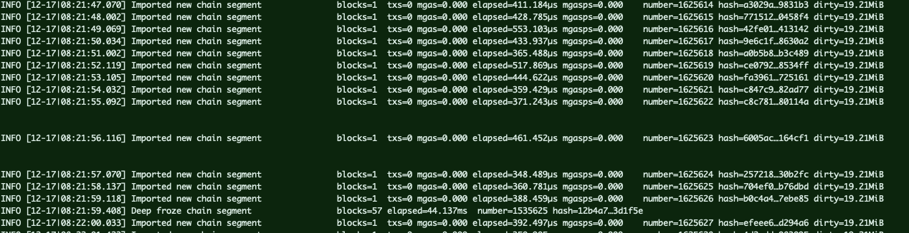

### Step 1: Install docker

You can install docker from the official website or you can run the commands provided below.

```
$ curl -fsSL https://get.docker.com -o get-docker.sh
$ sh get-docker.sh
```

### Step 2: Run docker for Heimdall

```
$ docker run -d --name matic-heimdall -p 1317:1317 -p 26656:26656 -p 26657:26657 -it maticnetwork/heimdall:CS-1001 bash
```

#### Check if your docker container is now running

```
$ docker ps

// Output should be something like this
CONTAINER ID        IMAGE                              COMMAND             CREATED             STATUS              PORTS                                                          NAMES
76cede244f3c        maticnetwork/heimdall:CS-1001   "bash"              13 seconds ago      Up 10 seconds       0.0.0.0:1317->1317/tcp, 0.0.0.0:26656-26657->26656-26657/tcp   matic-heimdall
```

Yay! Your heimdall is installed and is now running inside a docker container!

#### Attach to your container

```
$ docker exec -it matic-heimdall bash
```

Here you can access binaries like `heimdalld` and `heimdallcli`

Check out your version by running the command given below

```
$ heimdallcli version --long

// Expected Output
name: heimdall
server_name: heimdalld
client_name: heimdallcli
version: CS-1001
commit: 812ab544c1f658acf5f84c0b2e4bfe9943fa4854
go: go version go1.13.4 darwin/amd64
```

### Step 3: Run docker for Bor

#### Start docker container for Bor

```
docker run --name matic-bor -it maticnetwork/bor:CS-1001 bash`
```

To start bor you can run `bash start.sh`

And to verify you can run `tail -f logs/bor.log` and check the logs.

### Step 4: Join public testnet

#### 4.1: Get Heimdall genesis config

```js
$ git clone https://github.com/maticnetwork/public-testnets

//NOTE: Do make sure to join the relevant folder
$ cd public-testnets/<testnet version>
// Example: $ cd public-testnets/CS-1001

// copy genesis file to config directory
$ cp heimdall-genesis.json ~/.heimdalld/config/genesis.json

// copy config file to config directory
$ cp heimdall-config.toml ~/.heimdalld/config/heimdall-config.toml
```

> NOTE: In case you do not have a ropsten API key, generate one using: https://ethereumico.io/knowledge-base/infura-api-key-guide

Add your API key in file `~/.heimdalld/config/heimdall-config.toml` under the key `"eth_RPC_URL"`.

#### 4.2: Configure peers for Heimdall

Peers are the other nodes you want to sync to in order to maintain your full node. You can add peers separated by commas in file at `~/.heimdalld/config/config.toml` under `persistent_peers` with the format `NodeID@IP:PORT` or `NodeID@DOMAIN:PORT`

Refer to `heimdall-seeds.txt` for peer info in your testnet folder.

#### 4.3: Start & sync Heimdall

Before starting do verify you are on the correct version by running the below command

```
$ heimdallcli version --long

// Expected Output
name: heimdall
server_name: heimdalld
client_name: heimdallcli
version: CS-1001
commit: 812ab544c1f658acf5f84c0b2e4bfe9943fa4854
go: go version go1.13.4 darwin/amd64
```

**Run Heimdall**

Starting Heimdall is fairly easy, the below command will start heimdall using the genesis file in `~/.heimdalld/config/genesis.json`.

```js

$ heimdalld start

```

**Run rest-server**

The rest-server can be used by external services like explorer, faucets etc to connect to heimdall chain for fetching data and sending transactions.

```js

$ heimdalld rest-server

```

**Run Bridge**

Bridge is a helper package that sends transactions to heimdall on behalf of validators. All interactions with other chains happens via this bridge.

> NOTE: Skip this part of the step for Stage 0 as this is needed only when you stake to participate in validation and need to send transactions.

```js

$ bridge start --all

```

> Note: Bridge won't run without `rabbitmq` and `rest-server` so ensure they are running before trying to run bridge.

**Reset Heimdall**

> NOTE: To be used only if you need to restart Heimdall and delete old data in the event of a crash or if there are changes in genesis files.

Use the following to delete blockchain data and reset everything.

```js

$ heimdalld unsafe-reset-all

```

**Check sync status** 

To check the sync status you can run the follwing command on your node

```
$ curl http://localhost:26657/status

// Output 
{
  "jsonrpc": "2.0",
  "id": "",
  "result": {
    "node_info": {
      "protocol_version": {
        "p2p": "7",
        "block": "10",
        "app": "0"
      },
      "id": "c4abb0ddd80a413f35f9db2d5b4bc573417b95c4",
      "listen_addr": "tcp://0.0.0.0:26656",
      "network": "heimdall-wOVEJp",
      "version": "0.31.5",
      "channels": "4020212223303800",
      "moniker": "Vaibhavs-MacBook-Air.local",
      "other": {
        "tx_index": "on",
        "rpc_address": "tcp://0.0.0.0:26657"
      }
    },
    "sync_info": {
      "latest_block_hash": "E9219F1FBE049B19A919FBF39F46600ADCD7B690C29C92B37408F36046E51C1A",
      "latest_app_hash": "99418B51E32845F2164BCBA0772D5D357F548804E66E226287981B61B9A406BD",
      "latest_block_height": "3",
      "latest_block_time": "2019-12-12T06:45:29.823953Z",
      "catching_up": false
    },
    "validator_info": {
      "address": "EE9DF712A0D9D09A79525ABF05E72D44F796EDD3",
      "pub_key": {
        "type": "tendermint/PubKeySecp256k1",
        "value": "BLwVPibHZJX8//8URR3THmIVSY9lNyuuhCPRjLm57dZP6AJM+XP6Y7nVd3lnZgR1qBOnEnPop8RFEvOUHgeN5X4="
      },
      "voting_power": "10"
    }
  }
}
```

The key called `catching_up` will show your sync status, if it's not catching up it means that you are fully synced!

**Expected Output**

Your `heimdall-node` should be syncing now! Checkout `$GOPATH/src/github.com/maticnetwork/heimdall/logs/heimdalld.log` to get to the logs 🤩

If everything's well, then your logs should look something like this:


#### 4.4: Initialise genesis block for Bor

```js
// go to bor-config directory that you'll find under 'public-testnets' 
$ cd bor-config

// Using genesis file of validator bor node
$ cp ../<testnet version>/bor-genesis.json genesis.json

// initialize Genesis Block
$ $GOPATH/src/github.com/maticnetwork/bor/build/bin/bor --datadir dataDir init genesis.json

```

#### 4.5: Configure peers for Bor

To sync blocks on the testnet, you need to add peers. The file `static-nodes.json` in your relevant public-testnets version folder contains information for all the availalble seed nodes. Let's copy this file to your datadir so that when you start your nodes you already have peers!

```js
$ cp static-nodes.json ../bor-config/dataDir/bor/
```

**Adding additional peers (optional)**

If you have certain peers you always want to connect to, you can configure permanent static nodes by putting something like the following example into `<datadir>/bor/static-nodes.json`

```js
[
  "enode://f4642fa65af50cfdea8fa7414a5def7bb7991478b768e296f5e4a54e8b995de102e0ceae2e826f293c481b5325f89be6d207b003382e18a8ecba66fbaf6416c0@33.4.2.1:30303",
  "enode://ENODEID@ip:port"
];
```
For more info on how to connect to peers see [this](https://geth.ethereum.org/docs/interface/peer-to-peer).

#### 4.6: Start Bor

```js
// You'll find the following in bor-config directory
$ bash start.sh

```
**Expected Output**

Your `bor-node` should be syncing now! Checkout `logs/bor.log` to get to the logs 🤩

If everything's well, then your logs should look something like this:



**Ta-Da**

If your `Heimdall` and `Bor` logs are fine, that your node setup is complete. Congratulations on reaching so far!

Once you are done checking the logs or querying the data, you may stop all services and restart again soon as we start staking in the next stage.

#### 4.7: Query data

To see examples on how to query your full node and get network status, please refer here: https://api.matic.network/staking/cs1001/swagger-ui/